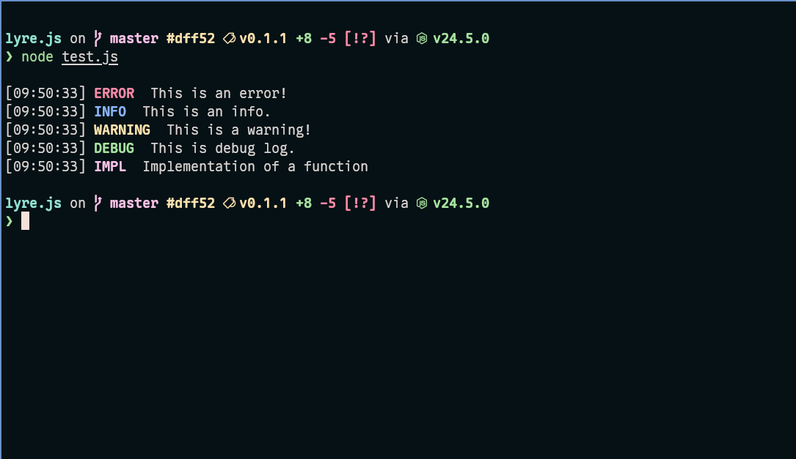

# lyre.js
## A CLI logging library for node.js cli apps.



## Features:
* Customizable Message
* Custom log class

## Example:
Code example of the above screenshot.
```js
import lyre from "./index.js"

lyre.error("This is an error!")
lyre.info("This is an info.")
lyre.warn("This is a warning!")
lyre.debug("This is debug log.")

new lyre.Custom("IMPL", ["bold", "magenta"])
    .log("Implementation of a function")
```


### Customizable message:

```js
lyre.error("This message has underline and bold text, ['underline', 'bold'])
```

**Each method accepts a second argument as an `array` of keywords to customize the message**

#### Customizable `keywords`.
This keyword base on linux [`console-codes`](https://man7.org/linux/man-pages/man4/console_codes.4.html). Available keywords are-

`[ 'bold', 'dim', 'italic', 'underline', 'invert', 'black', 'red', 'green', 'brown', 'blue', 'magenta', 'cyan', 'white' ]`

**To set Background color-**

`[ 'blackBg', 'redBg', 'greenBg', 'brownBg', 'blueBg', 'magentaBg', 'cyanBg', 'whiteBg' ]`

**Terminals may have their own color scheme. The names are kind of misleading. Terminal color scheme may be defined the `brown` as a yellow color.**

## API
parameter names:

`msg <string>`

`opts <array of keywords>` 
___

### `err(msg, opts)`
### `error(msg, opts)` same as `err`
### `warn(msg, opts)`
### `info(msg, opts)`
### `debug(msg, opts)`

## `Custom` class
parameter name:

`name <string>`
___
### `new Custom(name, opts)`
```js
const impl = new lyre.Custom("IMPL", ['bold', 'green'])
impl.log("custom log class", ['underline'])
```

### `Custom.log(msg, opts)`